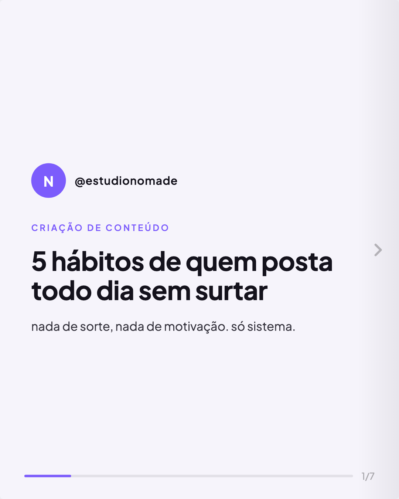
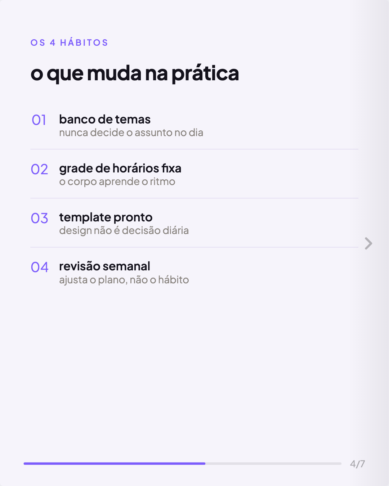
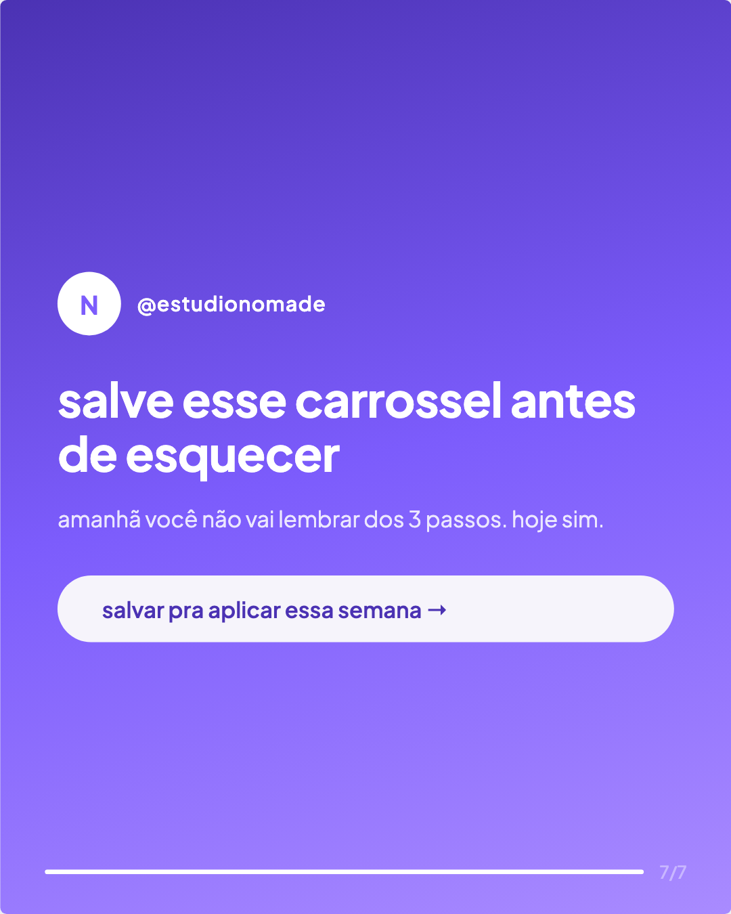

# 🟣 Carrossel Viral

**Peça pro Claude criar um carrossel de Instagram e receba os PNGs prontos pra postar — de verdade, sem print de tela, sem Photoshop, sem Canva.**

Isso aqui é uma *skill* (um pacote de instruções) que ensina o Claude a desenhar carrosséis completos — com paleta derivada da sua marca, tipografia consistente, barra de progresso, seta de arraste — e a **exportar cada slide como um arquivo `.png` real de 1080×1350px**, no formato certo pro Instagram. Funciona no [Claude Code](https://claude.com/product/claude-code) e no [Claude.ai](https://claude.ai) (chat normal).

<p align="center">
  
  
  
  
</p>

<p align="center"><em>Os 4 slides acima foram gerados por essa skill e exportados em PNG sem nenhuma edição manual — é o resultado real, não um mockup.</em></p>

---

## Por que isso é diferente de "peça um carrossel pro Claude"

Se você simplesmente pedir "faz um carrossel" pro Claude, ele te devolve texto ou, no máximo, um HTML bonito que você teria que printar slide por slide. Essa skill resolve o passo que sempre falta:

- ✅ Gera os 7 slides com direção de arte real (paleta derivada de 1 cor, tipografia com hierarquia, alternância claro/escuro)
- ✅ Cada carrossel sai com um **painel de exportação embutido** — clica e baixa o PNG, sem instalar nada
- ✅ Botão de **"baixar todos (.zip)"** — os 7 slides de uma vez
- ✅ Resolução fixa 1080×1350 (proporção 4:5, o padrão de carrossel do Instagram)
- ✅ Roda 100% no navegador (funciona com HTML gerado tanto pelo Claude quanto por qualquer outra IA)

---

## Como usar no Claude Code

1. Copie a pasta `skills/carrossel-instagram/` desta repo para `~/.claude/skills/carrossel-instagram/` no seu computador:
   ```bash
   git clone https://github.com/conhecendodigital/carrossel-viral.git
   mkdir -p ~/.claude/skills
   cp -r carrossel-viral/skills/carrossel-instagram ~/.claude/skills/carrossel-instagram
   ```
2. Abra o Claude Code em qualquer projeto e peça:
   > "cria um carrossel sobre [seu assunto]"
3. O Claude vai perguntar o nome da marca, @ do Instagram, cor principal, fonte e tom de voz — responda e ele gera o `.html` com todos os slides prontos.
4. Abra o arquivo `.html` gerado no navegador e clique nos botões do painel **"Exportar carrossel (PNG)"** — ou peça pro Claude rodar o script `scripts/exportar_png.py` pra já te entregar os PNGs sem precisar clicar em nada.

---

## Como usar no Claude.ai (chat comum, sem instalar nada)

O chat do Claude.ai não lê pastas do seu computador, então você entrega a skill direto na conversa:

1. Abra [`skills/carrossel-instagram/SKILL.md`](skills/carrossel-instagram/SKILL.md) neste repositório e copie todo o conteúdo.
2. Cole no chat do Claude.ai como a primeira mensagem, com um pedido no final. Por exemplo:

   ```
   Siga estas instruções para gerar um carrossel de Instagram.
   Ao final, gere um único arquivo HTML com o painel de exportação em PNG incluso.

   [cole aqui todo o conteúdo do SKILL.md]

   Agora crie um carrossel sobre: [seu tema aqui]
   Marca: [nome] | @: [seu instagram] | Cor principal: [hex ou descrição]
   ```

3. O Claude devolve o código do carrossel. Copie tudo, cole num arquivo `carrossel.html` no seu computador e abra com dois cliques no navegador.
4. Clique nos botões de exportar — os PNGs caem na sua pasta de Downloads.

> Dica: se você usa o Claude em [Projetos](https://claude.ai), cole o conteúdo do `SKILL.md` nas instruções personalizadas do projeto uma única vez — depois é só pedir o carrossel em qualquer conversa dentro dele.

---

## Exemplo pronto

A pasta [`exemplo/`](exemplo) tem um carrossel completo já gerado (`carrossel-exemplo.html`) sobre hábitos de postagem. Baixe o repositório, abra esse arquivo no navegador e teste o painel de exportação você mesmo antes de gerar o seu.

---

## Dicas pra viralizar o carrossel que você gerar

- **O slide 1 decide tudo**: se o gancho não prende em 1,5 segundo, ninguém arrasta pro slide 2.
- **Texto grande, pouca linha**: no máximo 3-4 linhas por slide — o Instagram é visto no celular.
- **Números vendem mais que opinião**: "73% das pessoas..." prende mais que "muita gente...".
- **CTA específico no último slide**: "salva pra aplicar depois" converte mais que "segue a gente".
- **Poste, comente no seu próprio post e responda os primeiros comentários rápido** — isso ajuda o alcance inicial do carrossel mais do que qualquer hashtag.

---

## Créditos

Criado e desenvolvido por **Matheus Soares** — [@omatheusai](https://instagram.com/omatheusai).

Se essa skill te ajudou a postar mais carrosséis, **dá uma ⭐ no repositório** — é o que faz mais gente encontrar isso.

## Licença

Livre para uso pessoal e comercial. Compartilhe à vontade, só mantenha os créditos.
